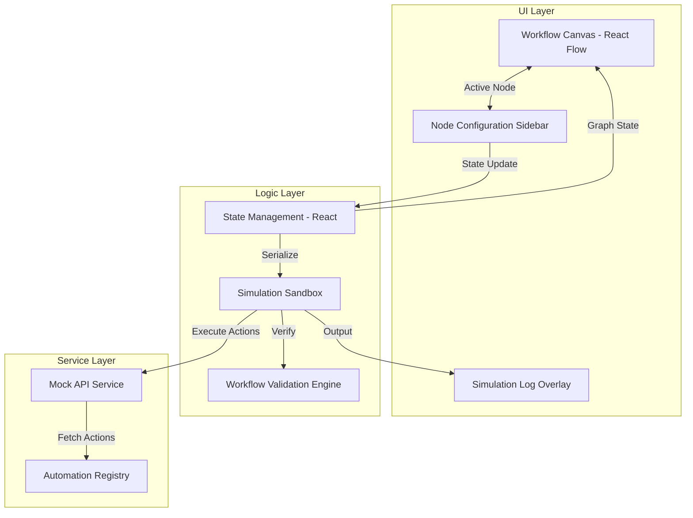

# HR Workflow Designer – Tredence Case Study

Hi! This is my submission for the **Full Stack Engineering Intern (AI Agentic Platforms)** case study at Tredence. 

## 🎯 The Use Case: Solving HR Complexity
Managing HR processes—like onboarding, performance reviews, or leave approvals—often involves a mess of manual emails, spreadsheets, and disconnected tools. 

**This project solves that by providing a visual-first automation designer.** It allows HR administrators to:
1.  **Visualize**: Map out complex lifecycles using a drag-and-drop canvas.
2.  **Configure**: Attach rich metadata, assignees, and due dates to specific tasks.
3.  **Automate**: Connect to third-party services (like Email or Document Generation) directly within the flow.
4.  **Validate**: Run a "Simulation Sandbox" to test the logic and catch bottlenecks before they happen in real life.

---

## 🏗️ Technical Architecture
I chose a modular architecture to ensure the designer is both high-performing and easy to extend.

### System Data Flow


### Folder Structure
The solution is intentionally structured for scalability:

### 1. Workflow Canvas
- React Flow canvas with multiple node types
- Start, Task, Approval, Automated, and End nodes
- Edge creation and deletion support through React Flow controls
- Node selection and editing
- Basic workflow validation rules

### 2. Node Configuration Panel
Each selected node opens a configurable side panel.

**Start Node**
- Start title
- Optional metadata key-value pairs

**Task Node**
- Title
- Description
- Assignee
- Due date
- Custom key-value fields

**Approval Node**
- Title
- Approver role
- Auto-approve threshold

**Automated Step Node**
- Title
- Action selection from a mock API list
- Dynamic action parameter fields

**End Node**
- End message
- Summary toggle

### 3. Mock API Layer
- `GET /automations` equivalent local mock
- `POST /simulate` equivalent local mock
- Async abstraction included in `src/services/mockApi.ts`

### 4. Workflow Test Sandbox
- Serializes current workflow graph
- Runs validation
- Returns step-by-step execution log
- Surfaces validation errors for missing flow integrity

## Tech Stack
- React
- TypeScript
- Vite
- React Flow
- Tailwind CSS

## Architecture Approach
The solution is intentionally structured for extensibility:

```bash
src/
├── components/
│   ├── canvas/
│   ├── forms/
│   ├── nodes/
│   ├── sidebar/
│   └── simulation/
├── hooks/
├── services/
├── types/
└── utils/
```

### Why these choices?
- **Separation of Concerns**: I kept the canvas logic, form handling, and simulation engine separate. This made debugging a lot easier and makes the code much cleaner to read.
- **Strict Typing (Discriminated Unions)**: I used TypeScript's discriminated unions to ensure that node data models are consistent. This prevents runtime errors when accessing specific fields (like `actionParams` only on automated nodes).
- **Extensible Forms**: The node configuration panel uses a reusable field array system. Adding custom metadata or new node types is as simple as adding a new interface.
- **Simulation First**: I prioritized the "Run Simulation" feature. It’s one thing to draw a graph, but seeing how it actually executes step-by-step is where the real value is for an admin.

## 🚀 Key Features Deep-Dive

### 1. Intelligent Workflow Canvas
Built with **React Flow**, the canvas supports:
- Custom node styling for different process steps.
- Real-time edge validation (e.g., ensuring a 'Start' node is always present).
- Fluid interaction with zoom, pan, and mini-map support.

### 2. Dynamic Configuration Panel
A contextual sidebar that changes based on the selected node. It handles complex data types like dates, nested key-value pairs, and dynamic dropdowns fetched from the mock API.

### 3. Simulation Sandbox
This is the "brain" of the app. It takes the current graph state, runs it through a series of logical checks, and produces a step-by-step execution log. This provides immediate feedback to the HR admin.

---

## 🛠️ Tech Stack
- **Frontend**: React 18, TypeScript, Vite
- **Graph Engine**: React Flow
- **Styling**: Tailwind CSS (for modern, responsive layouts)
- **Deployment**: Vercel ready

---

## 🏃 How to run
```bash
npm install
npm run dev
```

## 🎥 Suggested Demo Flow
1. **Build**: Connect Start → Task → Approval → Automated Step → End.
2. **Configure**: Select the "Task" node and assign it to a team member.
3. **Automate**: Choose "Send Welcome Email" in the Automated step.
4. **Test**: Click **Run Simulation** and watch the logs verify your process.

---

## 🔮 Roadmap (What I'd add next)
- **Undo / Redo**: For a better "sandbox" experience.
- **Workflow Templates**: Pre-built flows for standard HR tasks.
- **Persistence**: Connecting to a real backend like Supabase or Firebase.
- **E2E Testing**: Implementing Playwright to ensure flow integrity.

## A Note on the Submission
I really enjoyed working on this! It was a great exercise in balancing visual complexity with architectural simplicity. I focused on meeting the core requirements—React Flow proficiency, modular code, and dynamic form handling—while ensuring the app feels "ready to use." 

The original brief mentioned that architectural clarity is more important than pixel-perfect CSS, so I spent my time making sure the "engine" under the hood is solid and scalable. Thanks for checking it out!
